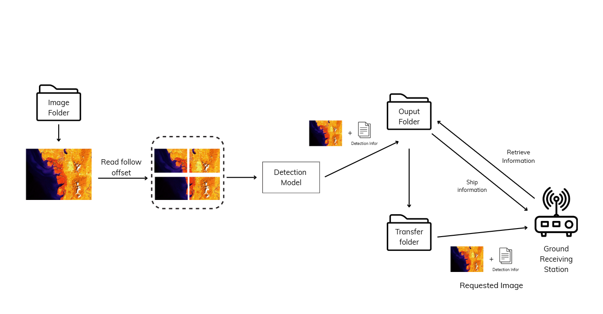
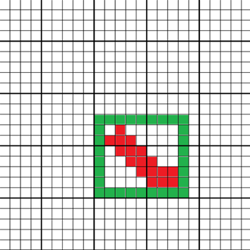

# **On-Board Ship Detection System: Optimized AI for Optical Satellite-Based Image Filtering**



## 1. Overview

**Scenario:**
In satellite-based Earth observation systems, transmitting all captured images to the ground is highly resource-intensive due to limited onboard storage, energy, and bandwidth. To address this issue, our system automatically **detects ships in optical satellite images** and **only transmits relevant images** — those containing ships — back to Earth.

This selective transmission significantly reduces the data load while maintaining essential information quality for maritime monitoring and analysis.

However, deploying AI directly on satellites presents unique challenges: limited computational power, strict energy constraints, and small memory capacity. Therefore, the **core AI models** must be carefully optimized to achieve a balance between **accuracy** and **efficiency**. Achieving this balance is crucial for the successful deployment of onboard AI systems.

---

## 2. Dataset and Tech

**Dataset:**
The project uses the **Airbus Ship Detection Challenge 2018** dataset organized by Airbus. The dataset contains approximately **193,000 RGB optical satellite images** of size **768×768 pixels**, but only about **one-fourth of the images actually contain ships**.
Ground-truth labels are provided as **pixel-wise masks**, which were preprocessed into **bounding boxes** using the following approach:

* Determine the smallest and largest pixel indices horizontally (`xmin`, `xmax`) and vertically (`ymin`, `ymax`).
* Construct the bounding box from `(xmin-1, ymin-1)` to `(xmax+1, ymax+1)`.
* Skip the ±1 adjustment if the box touches the image border.



Although Airbus does not specify the dataset’s spatial resolution, based on the specifications of its operational satellites — **Pléiades Neo (0.3 m)**, **Pléiades (0.5 m)**, **Vision-1 (0.87 m)**, and **SPOT (1.5 m)** — the dataset is estimated to consist of **sub-meter optical imagery**, suitable for ship detection research.


| Training Images | Test Images |
| :-------------: | :---------: |
|      19,910     |    2,180    |

---

## 3. Model Information
The models **YOLOv8nn** and **YOLOv11nn** were trained on the preprocessed dataset using **PyTorch 3.12** with **pre-trained COCO weights**. To support onboard deployment, we implemented two quantization strategies:

| Model                    | Description                                                                         |
| :----------------------- | :---------------------------------------------------------------------------------- |
| **YOLOv8nn (INT8PQ)**    | YOLOv8n nano converted from float32 → int8 post-training quantization.               |
| **YOLOv11nn (INT8PQ)**   | YOLOv11n nano converted from float32 → int8 post-training quantization.              |
| **YOLOv8nn (QAT+INT8)**  | YOLOv8n nano trained with Quantization-Aware Training (QAT) before int8 post-training quantization.  |
| **YOLOv11nn (QAT+INT8)** | YOLOv11n nano trained with Quantization-Aware Training (QAT) before int8 post-training quantization. |


---

## 4. How to Get Started

```bash
git clone https://github.com/nka151203 ship-detection-system-for-onboard-satellite.git
cd ship-detection-system-for-onboard-satellite
pip install -r requirements.txt
```

### 4.1 Run our system

```bash
python main.py
```
### 4.2 Train or Fine-tune Models (Optional)

```bash
model\yolo-qat-training.ipynb
```

---

## 5. Experimental Results

| Model                |  Size  | Params | mAP@0.5 | mAP@0.5:0.95 | Precision | Recall |  OPs  |
| :------------------- | :----: | :----: | :-----: | :----------: | :-------: | :----: | :---: |
| YOLOv8nn (INT8PQ)    | 3.3 MB |  3.2 M |  0.794  |     0.515    |   0.751   |  0.702 | 8.2 G |
| YOLOv11nn (INT8PQ)   | 3.0 MB |  2.6 M |  0.785  |     0.511    |   **0.768**   |  0.755 | 6.5 G |
| YOLOv8nn (QAT+INT8)  | 3.3 MB |  3.2 M |  **0.800**  |     **0.525**    |   0.710   |  0.752 | 8.2 G |
| **YOLOv11nn (QAT+INT8)** | **3.0 MB** |  **2.6 M** |  0.795  |     0.520    |   0.737   |  **0.767** | **6.5 G** |


---

## 🌚 Limitations and Future Work

* The dataset used represents only a subset of the original Airbus dataset to fit hardware limitations, hence may not capture all image variations.
* Never try on a real satellite.
* Future work aims to:

  * Integrate the quantized models into **real onboard AI pipelines** for satellite testing.
  * Explore **multi-class detection** (e.g., ships, ports, clouds).
  * Develop **real-time embedded inference** and **event-based transmission strategies**.


---

## 🤝 Reference
*  Quantization-Aware Training: https://arxiv.org/pdf/1712.05877
* Airbus Ship Detection Challenge: https://www.kaggle.com/competitions/airbus-ship-detection
---

## 📬 Contact

**Author:** Nguyễn Khắc An \
**Email:** [nka151203@gmail.com](mailto:nka151203@gmail.com)